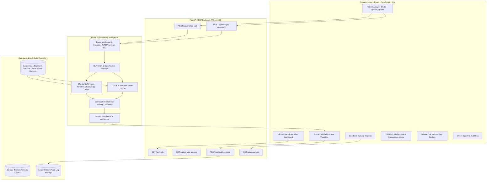

# System Architecture & Technical Specifications

**Project:** IS Standard Advisor  
**Problem Statement ID:** SIH26108  
**Repository:** `https://github.com/ranjan781/SIH-project.git`  
**Branch:** `done-by-sachin`

---

## 1. High-Level Architectural Diagram

---

## 2. Component Specifications

### 2.1 Frontend Component Hierarchy
- **`src/App.tsx`**: Central application state orchestrator managing tabs, current analysis results, officer modals, and backend connectivity status.
- **`src/components/Navbar.tsx`**: Enterprise government navbar with SIH26108 problem statement branding, live FastAPI health indicator, and tab navigation.
- **`src/components/DisclaimerBanner.tsx`**: Statutory disclaimer clarifying the Demo Research Dataset boundary.
- **`src/components/DashboardView.tsx`**: Executive overview with metrics cards, status distribution graphs, risk assessment pillars, and 1-click sample loaders.
- **`src/components/TenderAnalysisView.tsx`**: Dual-mode input studio (PDF/DOCX upload & clause text paste) with 5-stage progressive pipeline animation.
- **`src/components/RecommendationResultView.tsx`**: Detailed recommendation results with extracted parameters, cited vs active IS comparison, 5-point XAI rationale, and QCO status.
- **`src/components/StandardsExplorerView.tsx`**: Interactive searchable and filterable database with full standard detail drawer.
- **`src/components/DocumentComparisonView.tsx`**: Side-by-side clause diff viewer with parameter-by-parameter alignment table.
- **`src/components/PipelineMethodologyView.tsx`**: Interactive step-by-step visual architecture walkthrough.
- **`src/components/ResearchPaperView.tsx`**: 10-section technical paper presentation.
- **`src/components/AuditHistoryView.tsx`**: Officer decision history with real-time search and CSV log export.
- **`src/components/VerificationModal.tsx`**: Officer signoff modal with celebratory confetti on approval.
- **`src/components/ReportModal.tsx`**: Printable official Compliance Verification Certificate.

### 2.2 Backend Modular Architecture
- **`backend/main.py`**: FastAPI entrypoint with CORS, health routes, and routing.
- **`backend/models/schemas.py`**: Pydantic data models for strict payload validation.
- **`backend/services/doc_parser.py`**: Robust PDF, DOCX, and TXT parser with fallback ASCII decoders.
- **`backend/services/entity_extractor.py`**: NLP and regex entity extractor for IS codes, materials, grades, dimensions, and tests.
- **`backend/services/standards_service.py`**: Standards catalog querying and filtering service.
- **`backend/services/recommender.py`**: Recommendation ranking engine combining revision graphs and semantic similarity.
- **`backend/services/explainability.py`**: Explainable AI and officer audit trail persistence service.
- **`backend/api/routes.py`**: Clean REST API route handlers.
