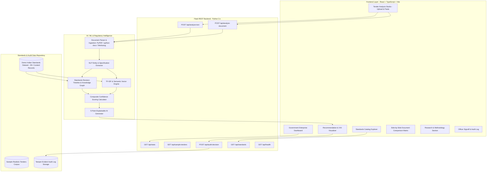

# System Architecture & Technical Specifications

**Project:** IS Standard Advisor  
**Problem Statement ID:** SIH26108  
**Repository:** `https://github.com/ranjan781/SIH-project.git`  
**Branch:** `done-by-sachin`

---

## 1. High-Level Architectural Diagram

---

## 2. Backend Component Specifications

### 2.1 Flask Modular Structure
- **`backend/app.py`**: Flask application entrypoint with Flask-CORS middleware, error handlers, and `/api/health`.
- **`backend/routes/analysis.py`**: Blueprint handling text and document analysis (`POST /api/analyze-text`, `POST /api/analyze-document`).
- **`backend/routes/standards.py`**: Blueprint handling standard queries, search, and dashboard statistics (`GET /api/standards`, `GET /api/stats`).
- **`backend/routes/audit.py`**: Blueprint handling officer signoffs and audit ledger (`POST /api/audit-decision`, `GET /api/audit-history`).
- **`backend/services/document_parser.py`**: Document parsing for PDF, DOCX, and TXT with `werkzeug.utils.secure_filename`.
- **`backend/services/standard_matcher.py`**: NLP and regex entity extractor for IS codes, materials, grades, dimensions, and tests.
- **`backend/services/revision_checker.py`**: Standards dataset catalog and revision timeline graph manager.
- **`backend/services/recommendation_engine.py`**: AI recommendation engine, compatibility matrix, and explainability synthesizer.
